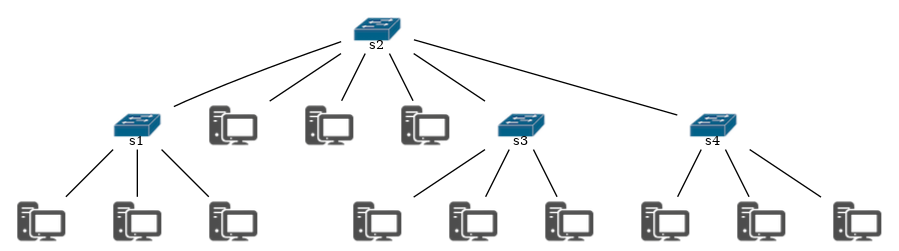

# Simulador de rede de computadores

>   A [simulação](https://pt.wikipedia.org/wiki/Simulação) de eventos [discretos](https://pt.wikipedia.org/wiki/Tempo_discreto) (SED) modela a operação de um sistema como uma sequência de eventos discretos no tempo. Cada evento ocorre em um determinado instante de tempo e marca uma mudança de [estado](https://pt.wikipedia.org/wiki/Estado_(computação)) no sistema. Entre eventos consecutivos, considera-se que o sistema não sofre 
>   mudança alguma, assim, a simulação pode saltar diretamente do instante  de ocorrência de um evento para o próximo [[1]](#referências).


Nas redes de computadores TCP/IP as informações geradas por uma máquina origem trafegam por dispositivos como comutadores (switchs) e roteadores, até chegar ao destino. Nessas redes os dados a serem transmitidos são colocados em pacotes IP e cada pacote é então encaminhado individualmente pela rede. Cada pacote possue, além da informação propriamente dita (*payload*), um cabeçalho que contém informações como endereço IP de origem, endereço IP destino e TTL (*time to live*).

O objetivo deste trabalho é desenvolver um simulador de eventos discretos para simular uma rede de computadores. A rede será composta somente por dispositivos do tipo:

-   ***endpoint*** - possui uma única interface de rede e está obrigatoriamente conectado em um dispositivo comutador L3 (*swicth*).
-   **comutador L3** - possui 24 portas, sendo que em cada porta poderá estar conectado um *endpoint* ou um outro comutador L3.

A topologia de rede e trafégo de pacotes devem ser informados antes de iniciar a simulação. Ou seja, o simulador deverá fornecer uma interface que permita ao usuário carregar a topologia, bem como o tráfego de pacotes por meio de arquivos textos.

Uma vez que a simulação tenha sido iniciada , o simulador deverá imprimir o caminho percorrido por um pacote, desde sua origem até o destino. Ou seja, sempre que um pacote for processado por um dispositivo, isso deverá aparecer como uma mensagem no console. No final da simulação deve-se imprimir um resumo indicando o total de pacotes que foram processados por cada dispositivo da rede.

Todo dispositivo deverá ter uma fila própria para armazenar os pacotes que deverá processar. Ou seja, essa fila será populada inicialmente por meio da carga do arquivo texto que possui o tráfego a ser simulado e durante a execução, sempre que receber um pacote de um outro dispositivo. Todo novo pacote gerado (obtido por meio do arquivo texto) deverá obrigatoriamente começar com *TTL = 3*. 

O comportamento para processamento de pacotes será:

-   ***endpoint*** - pega o primeiro pacote da fila e: 
    -   Se ele for a origem do pacote (indica que o pacote foi adicionado via arquivo de configuração da simulação), então encaminha o pacote para o dispositivo que está conectado em sua porta. 
    -   Se ele for o destino do pacote, então contabiliza-o como pacote processado.
    -   Se ele não for nem o destino e nem a origem, então contabiliza-o como pacote descartado.
-   **comutador L3** - pega o primeiro pacote da fila e verifica se o destino do pacote está conectado em uma de suas portas:
    -   Se sim, então encaminha o pacote para o dispositivo e contabiliza como pacote processado.
    -   Se não, decrementa o TTL do pacote e se o novo valor for 0, então descarta o pacote e contabiliza-o  como pacote descartado. Se o TTL for maior que 0, então propagada o pacote para todos os comutadores L3 que estão conectados em suas portas. Ao propagar o pacote contabiliza-o como pacote processado. Se não estiver conectado com nenhum outro comutador L3, então deve-se descartar o pacote e contabiliza-lo como pacote descartado.

## Simulador de eventos discretos

No simulador, cada evento ocorre em um determinado instante. Em cada instante você deverá processar o primeiro evento que estiver na fila de cada dispositivos da rede. Abaixo um exemplo de como poderia ser o laço principal do simulador:

```java
// carregar topologia
// carregar arquivo de tráfego

do{
    for(int i=0; i < totalDeDispositivos; i++){
        //executa o processamento para cada dispositivo
        dispositivos[i].processar();
    }
    
    aindaTemEventoParaProcessar = false;
    // pode ser que o processamento acima tenha incluído novos pacotes na fila de um outro dispositivo.
    for(int i=0; i < totalDeDispositivos; i++){
        //verifica se algum dispositivo ainda tem pacote na fila para ser processado
        if (!dispositivos[i].isFilaVazia()){
            aindaTemEventoParaProcessar = true;
            break;
        }
    }
}while(aindaTemEventoParaProcessar);

// imprime o resultado da simulação
```

### Formato do arquivo texto com a topologia da rede

Todo dispositivo no arquivo deverá possuir um **identificador único**, sendo que os *endpoints* devem iniciar com caractere `d` e os comutadores pelo caractere `s`. Abaixo um exemplo de como deve ser esse arquivo e a representação gráfica da topologia gerada por ele:

```dot
s1 -- {d1 d2 d3}
s2 -- {d4 d5 d6 s3 s4 s1}
s3 -- {d7 d8 d9}
s4 -- {d10 d11 d12}
```




### Formato do arquivo texto com o tráfego

Para simplificação, assuma que o endereço IP de cada dispositivo é na verdade seu **identificador único**, por exemplo, **d1**.

O tráfego a ser utilizado pelo simulador deverá ser carregado por meio de um arquivo texto no seguinte formato: **origem:destino:payload**. 

Tanto a origem quanto o destino deverão ser identificadores de **endpoints**. Abaixo um exemplo:

```
d1:d10:olá mundo
d1:d4:último projeto
d6:d2:férias chegando
d3:d5:fim
d7:d23:oi
```

## Relatório de Análise de requisitos

Como base na descrição acima e com as informações que colheu por meio de técnicas entrevista ou *brainstorm* com o cliente, faça um relatório de análise de requisitos. Esse relatório deverá conter as seguintes seções:

-   Escopo do projeto

-   Requisitos do sistema

    -   Requisitos funcionais
    -   Requisitos não funcionais

-   Regras de negócio

-   Modelos

    -   Casos de uso
    -   Matriz de rastreabilidade
        -   Diagrama de caso de uso UML
-   Diagrama de classes UML
    -   Diagrama de sequência UML

        -   Faça pelo menos um diagrama de sequência para representar alguma interação das classes que foram modeladas por você

Esse relatório deverá ser escrito em Markdown e deverá ser salvo com o nome `Readme.md` dentro do subdiretório `relatorio`, e este último deverá estar na raiz do repositório Github desse projeto. Todas imagens necessárias para esse relatório (p.ex. diagrama de caso de uso, diagramas de classe, etc) também deverão estar contidas nesse subdiretório `relatorio`.

Veja o arquivo PDF desse [modelo de relatório](https://github.com/emersonmello/modelos-latex/tree/master/relatorio/report). Ali tem um exemplo sobre matriz de rastreabilidade, contudo se precisar de mais detalhes recorra aos livros base da disciplina.

## Entregas:

-   Relatório de Análise de Requisitos (3 pontos)
    -   Obrigatoriamente dentro do subdiretório `relatorio`
-   Simulador de redes de computadores (6 pontos)
-   Apresentação do relatório e do simulador funcionando em sala de aula (1 ponto)


**ATENÇÃO:** É importante que desenvolva os modelos antes de iniciar a codificação.


### Referências

[1] - [ https://pt.wikipedia.org/wiki/Simulação\_de\_eventos\_discretos](https://pt.wikipedia.org/wiki/Simulação_de_eventos_discretos)